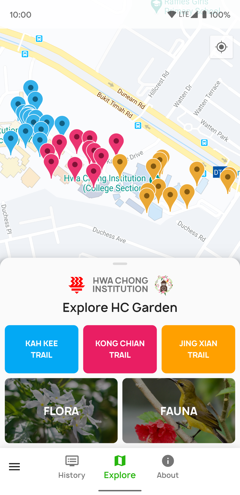

# HC Garden

The official newly-redesigned HC Garden app! Explore the diversity of flora and fauna within HCI, embark on trails with the inbuilt Google Maps interface, and take a dive into Hwa Chong's history! 

## TODOs

### High Priority

#### Map
- Highlight buildings on map, correct colour selection (high school/college) ✔️

#### Map Markers
- Going to location should also focus on the marker (need wait for package update) ✔️
- Marker window should also contain image (need wait for package update)

#### Onboarding
- Onboarding tutorial on how to use the apps ✔️

### Medium Priority

#### History Screen
- Categorise each photo by location
- Include a map for each location?

#### About Screen
- Include HC Garden Student Committee members ✔️

### Low Priority

#### Search
- Search should perhaps highlight the searchTerm within the name for clarity

#### Map
- Improved dark theme
- Correctly size dark marker icons

## Future Improvements
- Tablet support
- Web support
- Should there be a Google Maps for Dart SDK in the future, migrate to it asap.
